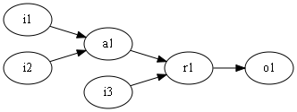

# regioncalc

CSS Regions を使って計算をします。

## Demo

- [加算器](http://xl1.github.io/regioncalc/demo/adder.html)
  - [source](https://github.com/xl1/regioncalc/blob/gh-pages/demo/adder.coffee)
- todo: 増やす

## Usage

- [sample](https://github.com/xl1/regioncalc/blob/master/demo/sample.coffee) のような [coffeecup](https://github.com/gradus/coffeecup) を書く

    ```coffee
    m.in  id:'i1'
    m.in  id:'i2'
    m.in  id:'i3'
    m.and id:'a1', in1:'i1', in2:'i2'
    m.or  id:'r1', in1:'a1', in2:'i3'
    m.out id:'o1', in1:'r1'
    ```

  
- regioncalc.coffee と連結して coffeecup に通す
  - `grunt compile --file=demo/sample`
- [HTML が生成される](http://xl1.github.io/regioncalc/demo/sample.html)

## Dependencies

- CSS Regions の基礎的なサポートを持つブラウザ
  - Chrome (with enable-experimental-web-platform-features flag)
  - Safari (動作未確認)
- `::region()` 疑似要素をサポートしているブラウザが現在ないため、[JavaScript polyfill](https://github.com/xl1/regionrulepolyfill) を使っています。
  - regioncalc で Regions を酷使することで polyfill 側のバグを洗い出すという意図があります。
